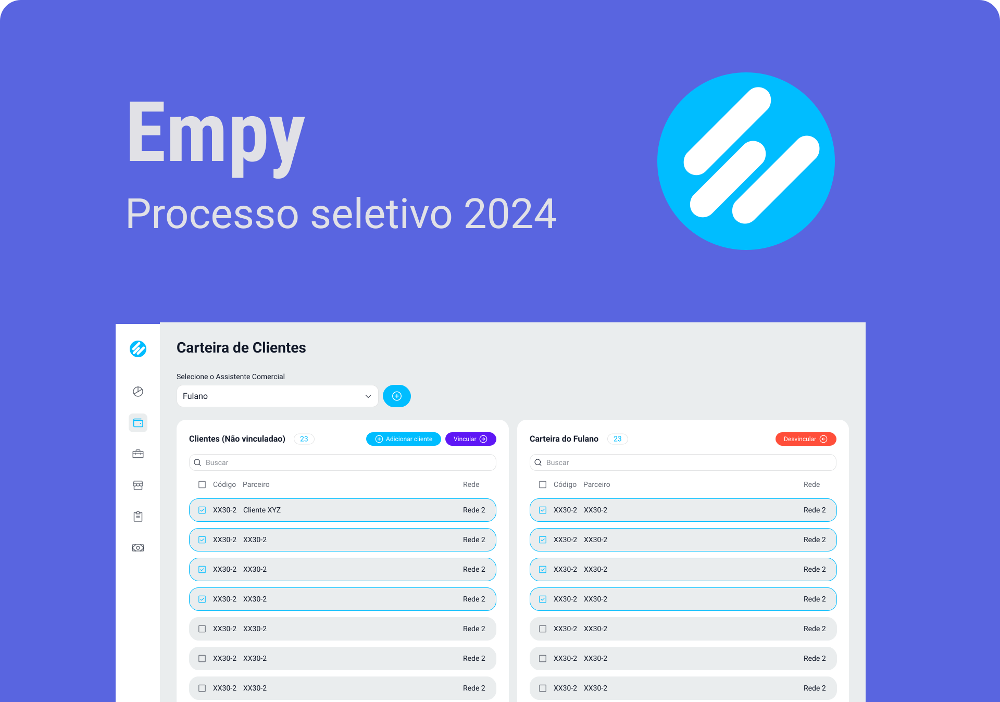

<h1 align="center">Empy</h1>
<p align="center">
Erick Marques Cabral
</p>
<p align="center">
Esse projeto é exclusivo e foi promovido pela Empy para o processo seletivo 2024. <br/>
<a href="https://empbank.com.br/">Empbank🔗</a>.
</p> <br/>

<p align="center">
  <a href="#-descrição">Descrição do Projeto</a>&nbsp;&nbsp;&nbsp;|&nbsp;&nbsp;&nbsp;
  <a href="#-tecnologias">Tecnologias</a>&nbsp;&nbsp;&nbsp;|&nbsp;&nbsp;&nbsp;
  <a href="#-layout">Layout</a> 
</p>

<p align="center">
  
</p>

## 💻 Descrição
Nesse projeto, desenvolvi uma aplicação para gerenciar a carteira de clientes da Empy Bank,
permitindo o cadastro de clientes e assistentes comerciais, e a associação entre eles.
O principal reguisito é implementar as operações CRUD (Criar, Ler, Atualizar, Deletar) para ambas as entidades.
 
Funcionalidades:

- Criar cliente;
- Criar assistente comercial;
- Criar relação entre cliente e assistente;
- Desvincular cliente de assistente.

Conceitos abordados:

- Estados;
- Formulários;
- Propriedades;
- Consumo de API;
- Componentização;
- Imutabilidade do estado;
- Listas e chaves no ReactJS.

## 🚀 Tecnologias
Esse projeto foi desenvolvido com as seguintes tecnologias:

- Next.JS
- ReactJS
- HTML e CSS
- JavaScript
- TypeScript
- Prisma (ADAPTER)
- Zood
- Figma
- Git e Github

## 👽 Comecando

Primeiro, baixe o progeto usando:

```bash
git clone https://github.com/erickmarquesc/EmpyBank.git
```
Logo depois, execute a instalação de todas as dependendias: Exemplo
```bash
npm i
```
Assim que todas as dependencias estiverem instaladas, execute o servidor de desenvolvimento:
```bash
npm run dev
# or
yarn dev
# or
pnpm dev
```

Abra [http://localhost:3000/](http://localhost:3000/).

## 🔖 Layout

Você pode visualizar o layout do projeto através [DESSE LINK](https://[www.figma.com/file/hRlkN6MBTit4bBWQt3HQyn/Ignite-Call?node-id=339%3A74&t=v4AGJOMRFhCm4SRc-1](https://www.figma.com/file/4SULhM65H2HrRB8RS9t1Zf/Desafio-Empy-Bank-(Copy)?type=design&node-id=2483-180&mode=design&t=LUw3xdvVLk04oOHq-0)). É necessário ter conta no [Figma](https://figma.com) para acessá-lo.
